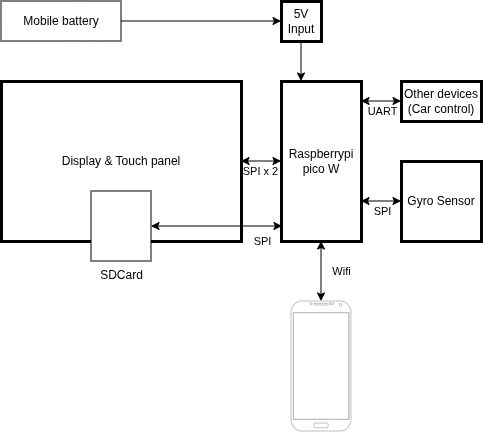
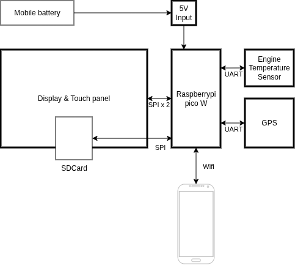

# 2026-logger-frontpanel
This is the source code for Ecorun Logging system of front panel which refined on 2026.

This system is using since 2024. Old version is available at [this repository](https://github.com/TMCIT-Ecorun/2024-logger-frontpanel/).

## INVENTORY
- raspberrypi pico (w)
- [touch screen with ILI9341 display controller and XPT2046 touchpanel controller](https://akizukidenshi.com/catalog/g/g116265/)
- and SD card slot (2024(disabled))

## How to use?
### Clone (first time only)
```bash
git clone https://github.com/TMCIT-Ecorun/2026-logger-frontpanel.git
cd 2026-logger-frontpanel
```

### Build
```bash
mkdir build && cd build
cmake ..
make
```
The uf2 file for installing this on Raspberry pi pico will be generated on root of "build" directory.

## Other informations
This system is under development. Rewriting with pico-sdk.   
For Development, please see [Wiki](./wiki)

## System Overview
### 2024 Overview

### 2025 Overview

### 2026 Overview
WIP
