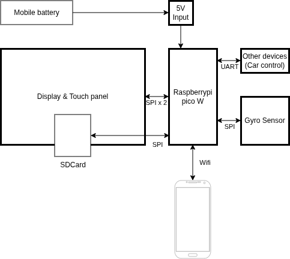
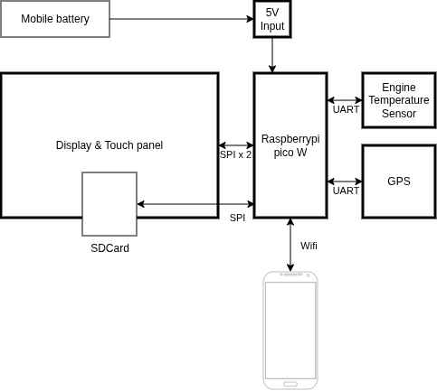

# 2026-logger-frontpanel
This is the source code for Ecorun Logging system of front panel which refined on 2026.

This system is using since 2024. Old version is available at [this repository](https://github.com/TMCIT-Ecorun/2024-logger-frontpanel/).

## INVENTORY
- raspberrypi pico (w)
- [touch screen with ILI9341 display controller and XPT2046 touchpanel controller](https://akizukidenshi.com/catalog/g/g116265/)
- and SD card slot (2024(disabled))

## How to use?
### Clone (first time only)
```bash
git clone https://github.com/TMCIT-Ecorun/2026-logger-frontpanel.git
cd 2026-logger-frontpanel
git submodule update --init --recursive
```

### Build
```bash
mkdir build && cd build
cmake ..
make -j4
```
The uf2 file for installing this on Raspberry pi pico will be generated on root of "build" directory.

### Run the GUI on a PC
The GUI uses the same LVGL UI module as the Pico firmware. The PC backend uses SDL2 and supplies mock telemetry so the screen can be operated with a mouse.

Required software on Linux:
- CMake
- GCC/G++
- pkg-config
- SDL2 development package (`libsdl2-dev` on Debian/Ubuntu)

Build and run:
```bash
cmake -S pc -B build-pc
cmake --build build-pc -j4
./build-pc/ecorun_front_panel_pc
```

The shared GUI module is `src/ui.c` with its public interface in `include/gui/`. Hardware specific operations are supplied through `GuiPlatform`, so an ESP32 port only needs a small platform adapter.

## Persistent settings and first-boot touch calibration

The Pico stores the front-panel settings as a small JSON record in the final 4 KiB flash sector. The current record contains display brightness and XPT2046 touch calibration, and the format is intentionally extensible for additional settings.

On first boot, or when the stored record is invalid, a four-point touch calibration screen is shown before the dashboard. The measured calibration is saved to flash after completion. Brightness changes are applied immediately to the PWM backlight, but the persistent JSON is written only once when the slider is released, rather than for every slider movement.

The normal UI has no tab bar: the dashboard and settings are separate full-screen pages changed by horizontal swipes. Only the settings page scrolls vertically; the dashboard itself is fixed.

## Other informations
This system is under development. Rewriting with pico-sdk.   
For Development, please see [Wiki](./wiki)

## System Overview
### 2024 Overview

### 2025 Overview

### 2026 Overview
WIP
